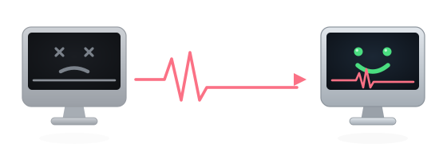

<p align="center">
  
</p>

<h1 align="center">mac-lifeline</h1>

<p align="center">
  <strong>Reach, clean, and maintain old Macs that no modern tool will touch</strong><br>
  <em>using only built-in <code>ssh</code> + <code>launchd</code> and a small hardened container you control.</em>
</p>

[](https://github.com/curtismercier/mac-lifeline/actions/workflows/ci.yml)
[](#supported-macos)
[](#how-the-tunnel-works)
[](#why-mac-lifeline)
[](LICENSE)
[](CONTRIBUTING.md)

`mac-lifeline` is for the machines other tools gave up on: macOS as far back as **High Sierra (10.13)**,
sitting behind **CGNAT or Wi-Fi client-isolation** (Starlink, hotel, café, guest networks), too old for
Tailscale, cloudflared, or any modern agent. Like Tailscale or ngrok, it lets you reach a machine with no
inbound connectivity — but it needs **nothing installed** on the Mac beyond what Apple already ships, so
it runs on hardware and OS versions everything else has dropped.

> Extracted from a real field engagement: a 2010 iMac on High Sierra, behind a Starlink router, that
> "couldn't browse." Remote diagnosis → adware removal → a standing remote-support line → done.

---

## Contents

- [Why mac-lifeline?](#why-mac-lifeline)
- [Supported macOS](#supported-macos)
- [Features](#features)
- [How the tunnel works](#how-the-tunnel-works)
- [Quick start](#quick-start)
- [The maintenance tools](#the-maintenance-tools)
- [Security model](#security-model)
- [Heads-up: Gatekeeper &amp; antivirus](#heads-up-gatekeeper--antivirus)
- [Gotchas (paid for, so you don't)](#gotchas-paid-for-so-you-dont)
- [When to use what](#when-to-use-what)
- [Roadmap](#roadmap)
- [Related projects](#related-projects)
- [Contributing](#contributing) · [Security](#security) · [License](#license)

---

## Why mac-lifeline?

<p align="center">
  
</p>

**Tailscale and cloudflared both require macOS 10.15+.** On a 10.13 or 10.14 machine they simply won't
install — which is exactly the machine a non-technical owner is most likely still running, and least able
to fix themselves. Commercial remote-desktop apps (TeamViewer, AnyDesk) need a GUI install, an account,
and someone at the keyboard to approve a session.

`mac-lifeline` leans on the substrate that ships on **every** Mac back to the Intel era: OpenSSH and
`launchd`. The Mac dials *out* to a throwaway container on a VPS you own and reverse-forwards its own SSH
port. You hop through the container to reach it — from anywhere, through any CGNAT or AP isolation, with
nothing to install and nothing listening for inbound connections.

## Supported macOS

| macOS | Version | Tunnel | Cleanup tools | Notes |
|-------|---------|:------:|:-------------:|-------|
| High Sierra | 10.13 | ✅ | ✅ | The original target. `ssh` + `launchd` present out of the box. |
| Mojave | 10.14 | ✅ | ✅ | |
| Catalina | 10.15 | ✅ | ✅ | Tailscale also works here if you'd rather use it. |
| Big Sur → Sequoia | 11–15 | ✅ | ✅ | Works fine, though modern agents are an option on these. |
| Older (10.6–10.12) | — | likely | partial | `ssh` + `launchd` long predate these; **untested** — reports welcome. |

> Verified on 10.13. Anything marked "likely" is unverified — open an issue if you confirm one.

## Features

- **Runs on Macs nothing else will touch** — built-in `ssh` + `launchd` only, back to 10.13. No agent,
  no Homebrew, no modern toolchain required on the target.
- **CGNAT- and isolation-proof** — the Mac dials *out*; nothing needs to reach *in*. Works behind
  Starlink, hotel/guest Wi-Fi, and double-NAT.
- **Zero idle attack surface** — on-demand by design. `docker stop` the container between sessions and
  there is nothing to attack. Bring it up only when you need in.
- **Hardened by default** — a leaked Mac key is *inert* against your VPS: tunnel-only user, no shell, no
  local forwarding, one permitted listen address. Verified with negative tests.
- **Two keys, two scopes** — Mac→container (tunnel) and you→Mac (control) never overlap.
- **Owner-friendly tools** — double-click `.command` maintenance scripts with native macOS password
  prompts, so a non-technical owner never has to open Terminal or type a `sudo` line.

## How the tunnel works

```
 OLD MAC (CGNAT, no inbound)              VPS you control                 YOU
 ┌───────────────────────┐         ┌────────────────────────┐      ┌──────────────┐
 │ launchd daemon:        │  dials  │  hardened container     │ hop  │ ssh (control │
 │ ssh -N -R 9922:lo:22 ──┼────────▶│  tunnel-only, port 9922 │◀─────┼─ key) via -J │
 │ (its own sshd on :22)  │   out   │  no shell, no -L        │      │  or Proxy    │
 └───────────────────────┘         └────────────────────────┘      └──────────────┘
```

The Mac's `launchd` daemon holds a reverse SSH connection open to a container that does exactly one
thing: accept that one reverse forward and nothing else. You reach the Mac by hopping through the
container. Auto-reconnects, survives reboots, comes back on its own after a network drop.

## Quick start

**You need:** a VPS with a public IP and Docker, and physical-or-remote access to the Mac once to run a
setup script.

### Before you start — enable this on the Mac

The installer sets up the Mac dialing *out*. To **reach** it, you connect back into the Mac's own SSH
server — which is **off by default**. Turn it on, or the tunnel will come up green but you still won't be
able to log in:

- **Remote Login — required.** System Settings → General → Sharing → **Remote Login = On**, and allow your
  admin user. (macOS 10.13: System Preferences → Sharing → Remote Login. CLI: `sudo systemsetup -setremotelogin on`.)
- **Stop it sleeping** *(for an always-on line)*. Energy Saver → computer sleep = **Never** (the display
  may still sleep). A sleeping Mac drops the tunnel and is unreachable until something wakes it.
- **Restart after a power cut.** Energy Saver → **Start up automatically after a power failure**.
- **macOS 10.15+: Full Disk Access for `sshd`.** Privacy & Security → Full Disk Access → add `sshd` (or
  `sshd-keygen-wrapper`), or TCC blocks remote access to Desktop/Documents and some admin tasks. (Not a
  thing on 10.13–10.14.)
- **FileVault caveat.** With FileVault on, a cold boot stays disk-locked until someone unlocks at the
  console, so the daemon and `sshd` never start — unattended reboots won't reconnect on their own. Leave
  it off for hands-free recovery, or accept one physical unlock after a full power-down.

`mac-setup.sh` checks whether Remote Login is listening at the end and warns you if it isn't.

### 1 · On the VPS — run the rendezvous container

```bash
docker build -t mac-lifeline ./tunnel/container

docker run -d --name mactunnel --restart no -p 47222:22 \
  -e TUNNEL_PUBKEY="<the Mac's tunnel pubkey from step 2>" \
  --security-opt no-new-privileges:true --cap-drop ALL \
  --cap-add CHOWN --cap-add SETUID --cap-add SETGID --cap-add DAC_OVERRIDE \
  --cap-add FOWNER --cap-add SYS_CHROOT --cap-add KILL --tmpfs /run  mac-lifeline
```

### 2 · On the Mac — install the reverse tunnel

Nothing to clone, nothing to edit — pipe the installer straight onto the Mac, passing your VPS host and a
unique launchd label as env vars:

```bash
curl -fsSL https://raw.githubusercontent.com/curtismercier/mac-lifeline/master/tunnel/mac-setup.sh \
  | VPS_HOST=1.2.3.4 LABEL=com.you.mactunnel bash      # asks for the Mac password once
```

All config is env-overridable: `VPS_HOST`, `VPS_PORT` (default `47222`), `REVERSE_PORT` (default `9922`),
`LABEL`, and optionally `CONTROL_PUBKEY` (your control key, installed on the Mac's admin account).

> Prefer to read before you run? Download and inspect it first, or clone the repo and edit the defaults
> at the top of [`tunnel/mac-setup.sh`](tunnel/mac-setup.sh), then `bash tunnel/mac-setup.sh`.

It generates a key, installs a `launchd` daemon that auto-reconnects and survives reboots, and prints the
Mac's **public key**. Paste that into the container's `TUNNEL_PUBKEY` (step 1) and (re)start it.

### Removing it later

Double-click [`tunnel/uninstall.command`](tunnel/uninstall.command) (or
`bash tunnel/uninstall.command --label <your.label>`) on the Mac to stop and fully remove the daemon,
its key directory, and its log. It confirms before doing anything and never touches your
`authorized_keys`.

### 3 · Connect from anywhere

```bash
ssh -J you@VPS -p 9922 <admin>@127.0.0.1
# …or as a one-liner ProxyCommand:
ssh -o ProxyCommand="ssh you@VPS docker exec -i mactunnel nc 127.0.0.1 9922" <admin>@127.0.0.1
```

### Not in the same room as the Mac?

The installer is the same; the client runs one command and you get in. `mac-setup.sh` is mode-aware —
it can have the client paste a code back to you, use a key you pre-authorized, or self-enroll — and it
turns on Remote Login for them. See **[docs/REMOTE-ONBOARDING.md](docs/REMOTE-ONBOARDING.md)** for the
three levels, the message to text your client, and where to host the one-time link.

## The maintenance tools

Double-click `.command` files in [`tools/`](tools/) — they open in Terminal, ask for the Mac password
through the native dialog *once*, and print **every action they take**. Re-runnable any time.

### `clean-adware.command`

Removes known Mac adware and junk software across **all** user accounts and the system folders.

- **Scan-first, then confirm.** It lists *exactly* what it found and removes nothing until you type
  `yes`. Run `clean-adware.command --dry-run` to see what would be removed and exit without touching
  anything.
- **What it removes:** items whose names match a curated list of known adware families — MacKeeper,
  Adload / "Search Manager", Genieo, Bundlore, Pirrit, InstallMac, SearchMine, Advanced Mac Cleaner,
  and more. The match list lives at the top of the script (`PAT=`); adding a family is a one-line PR.
- **What it will *never* touch:** anything not matching a known-adware name. It does not heuristically
  guess, quarantine your documents, or remove legitimate apps. It prints each path as it goes.
- **Safe to re-run** and safe to read first — it's plain `bash`.

### `mac-tune-up.command`

A health report — disk space, SMART status, RAM pressure — plus an optional cleanup pass. Read-only
unless you opt into the cleanup.

## Security model

**A leaked Mac tunnel key is inert against your VPS.** The whole design assumes the Mac's key could be
stolen and still grants an attacker nothing useful:

- **Tunnel user:** `nologin`, key-only. `authorized_keys` is pinned with
  `restrict,port-forwarding,permitlisten="127.0.0.1:9922"`.
- **sshd `Match User tunnel`:** `AllowTcpForwarding remote` (no `-L`), `PermitOpen none`,
  `PermitListen 127.0.0.1:9922`, `ForceCommand /sbin/nologin`.
- **Container:** no `--privileged`, no host network, no mounts → it cannot see the VPS host or any other
  service on it.
- **On-demand:** `docker stop` between sessions = zero attack surface.
- **Two keys, two scopes:** Mac→container (tunnel) and you→Mac (control) never overlap.

These claims are not just asserted — they're **tested**. [`tunnel/verify-hardening.sh`](tunnel/verify-hardening.sh)
builds the container, runs it with a throwaway key, and proves each property: interactive shell blocked ·
`-R` to the permitted port allowed · `-R` to any other port denied · effective sshd policy for the tunnel
user inspected directly. It exits non-zero if any check fails, and runs on every push via
[CI](.github/workflows/ci.yml).

```bash
bash tunnel/verify-hardening.sh   # requires docker + ssh
```

> **Known trade-off — first-connect trust.** The Mac's `launchd` daemon currently dials the VPS with
> `StrictHostKeyChecking=no` + `UserKnownHostsFile=/dev/null` so it connects unattended on a fresh box.
> That leaves the *Mac→VPS* hop theoretically MITM-able on first connect. If your threat model needs it,
> pin the container's host key in the daemon's `known_hosts` instead. Pinning support is on the
> [roadmap](#roadmap).

## Heads-up: Gatekeeper &amp; antivirus

Two friction points worth knowing before you deploy:

- **Reverse tunnels look like malware to some AV.** Like `frp` and `ngrok`, a tool that opens an outbound
  tunnel can trip antivirus heuristics. There is nothing malicious here — but if you run third-party AV on
  the Mac, you may need to allow the `launchd` job.
- **Unsigned `.command` files** will prompt Gatekeeper on first run ("downloaded from the internet"). For
  an owner you're helping, transfer them locally and right-click → **Open** once, or strip the quarantine
  flag: `xattr -d com.apple.quarantine "Your Tool.command"`.

## Gotchas (paid for, so you don't)

- macOS has no `timeout(1)`. Don't assume GNU coreutils.
- Alpine's `adduser -D` **locks** the password (`!` in `/etc/shadow`), which makes sshd reject the user as
  "invalid" — patch it to `*`. (The container already does this; know it if you fork.)
- **Never retype an SSH key off a photo** — OCR turns `l→1` and `O→0`. Transfer via a file or short URL.
- Docker's published ports bypass the host's `INPUT` firewall chain — they're filtered in `DOCKER-USER`,
  not `INPUT`. Firewall accordingly.
- Hand owners **double-click `.command` tools** and use `osascript … with administrator privileges` for a
  native password box instead of teaching them `sudo` in Terminal.

## When to use what

| | Old Mac (10.13–10.14)? | No inbound / CGNAT | Nothing to install on target | Best for |
|---|:---:|:---:|:---:|---|
| **mac-lifeline** | ✅ | ✅ | ✅ (built-in `ssh`) | Old/unreachable Macs you administer headless |
| Tailscale | ❌ (needs 10.15+) | ✅ | ❌ (installs agent) | Modern fleets, mesh VPN |
| ngrok | ⚠️ | ✅ | ❌ (binary) | Quick public demos of a local port |
| frp | ✅ | ✅ | ❌ (binary) | Self-hosted multi-service tunneling |
| TeamViewer / AnyDesk | ⚠️ | ✅ | ❌ (GUI app + account) | Interactive screen control with the owner present |
| macOS Screen Sharing / VNC | ✅ | ❌ (needs inbound) | ✅ (built-in) | Same-LAN GUI access |

## Roadmap

- [x] `--dry-run` + scan-then-confirm for `clean-adware` (show, confirm, then remove)
- [x] `tunnel/uninstall.command` — cleanly unload the daemon and remove keys/plist
- [x] `verify-hardening.sh` — codify the negative security tests as a runnable check
- [x] CI: `shellcheck` + `hadolint` + a container hardening smoke test
- [x] Remote onboarding, **Levels 1-3** — mode-aware `curl|bash` installer (Remote Login auto-enable, clipboard hand-off), `authorize-key.sh`, and a self-deployable [`onboard-worker/`](tunnel/onboard-worker/) (one-time links + Level-3 self-enroll via an outbound VPS poll agent). See [REMOTE-ONBOARDING.md](docs/REMOTE-ONBOARDING.md).
- [ ] `tunnel/vps-setup.sh` to mirror `mac-setup.sh` (no hand-copied `docker run`)
- [ ] Host-key pinning option for the Mac→VPS hop
- [ ] Externalize the adware signature list for easy community PRs
- [ ] Client-deliverable templates (plain-English summary / options pages)

Want one of these? Open an issue or a PR — see [CONTRIBUTING.md](CONTRIBUTING.md).

## Related projects

- [frp](https://github.com/fatedier/frp) · [rathole](https://github.com/rapiz1/rathole) — general-purpose
  reverse proxies for modern hosts (what you'd reach for when the target *can* run a binary).
- [OpenCore Legacy Patcher](https://github.com/dortania/OpenCore-Legacy-Patcher) — run current macOS on
  unsupported Macs (the upgrade path, where the hardware allows).
- [privacy.sexy](https://github.com/undergroundwires/privacy.sexy) — transparent, scriptable macOS/Windows
  cleanup and hardening.

## Contributing

PRs welcome — especially **new adware signatures** and **macOS version reports**. See
[CONTRIBUTING.md](CONTRIBUTING.md).

## Security

Found a security issue? Please report it privately — see [SECURITY.md](SECURITY.md). Do not open a public
issue for vulnerabilities.

## License

[MIT](LICENSE) © 2026 Curtis Mercier
</content>
</invoke>
